# Linux Homework

This repository contains my Linux homework tasks and the commands I practiced while working with Linux in WSL (Ubuntu on Windows).

## Task 1: Soft Link & Hard Link

### Objective

- Understand the difference between a **soft link (symbolic link)** and a **hard link**.
- Learn the commands used to create both types of links.
- Practice deleting links and the original file.
- Understand what happens to each link when the original file is deleted.
- Prepare the concepts for Linux interview questions.

### Commands Practiced

#### 1. Create the original file

```bash
echo "Hello Linux" > original.txt
```

Check the contents:

```bash
cat original.txt
```

Output:

```text
Hello Linux
```


#### 2. Create a hard link

```bash
ln original.txt hard.txt
```

This creates `hard.txt` as a hard link to `original.txt`.

#### 3. Create a soft link

```bash
ln -s original.txt soft.txt
```

This creates `soft.txt` as a symbolic (soft) link pointing to `original.txt`.


#### 4. Check the links

```bash
ls -li
```

The `-i` option displays the **inode number**.

For a hard link, `original.txt` and `hard.txt` have the same inode number because they refer to the same file data.

The soft link has a different inode number and displays:

```text
soft.txt -> original.txt
```

#### 5. Delete the hard link

```bash
rm hard.txt
```

The original file is still available because deleting one hard-link name does not delete the file data while another link to the same inode exists.

#### 6. Delete the soft link

```bash
rm soft.txt
```

This removes only the symbolic link.

#### 7. Test the hard link after deleting the original file

The hard-link behavior was also tested by creating the links again, deleting `original.txt`, and then checking:

```bash
cat hard.txt
```

Output:

```text
Hello Linux
```

The hard link still works because it refers directly to the same inode/data.

However, the symbolic link no longer works after the original file is deleted:

```bash
cat soft.txt
```

Result:

```text
cat: soft.txt: No such file or directory
```

This demonstrates that a symbolic link stores a **path to the target**, so it becomes a broken/dangling link when the target is removed.

> Note: In the screenshots, `soft.txt` was removed before the final `ls -li`, so the final listing shows the hard link and the broken symbolic link created during the subsequent test.

## Hard Link vs Soft Link

| Feature | Hard Link | Soft Link |
|---|---|---|
| Command | `ln original.txt hard.txt` | `ln -s original.txt soft.txt` |
| Inode | Same inode as target | Different inode |
| Points to | File's inode/data | File path/name |
| Works after original name is deleted? | Yes | No, if the target path no longer exists |
| Can point to a directory? | Generally no | Yes |
| Can cross file systems? | No | Yes |
| If target is deleted | Other hard links still work | Link becomes dangling/broken |

### Simple Interview Answer

**What is the difference between a hard link and a soft link?**

A **hard link** is another directory entry pointing to the same inode as the original file. Therefore, deleting the original filename does not remove the data as long as another hard link exists.

A **soft link**, or symbolic link, is a separate file that stores the path of another file. If the target file is deleted or moved, the symbolic link can become broken.

### Useful Commands

```bash
# Create a file
echo "Hello Linux" > original.txt

# Display file contents
cat original.txt

# Create hard link
ln original.txt hard.txt

# Create soft link
ln -s original.txt soft.txt

# Show inode numbers and links
ls -li

# Remove a file or link
rm filename

# Check file contents
cat filename
```

## Screenshots

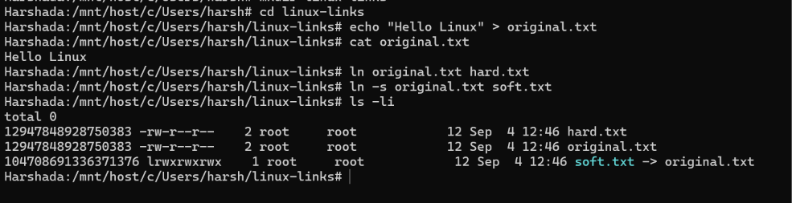
 

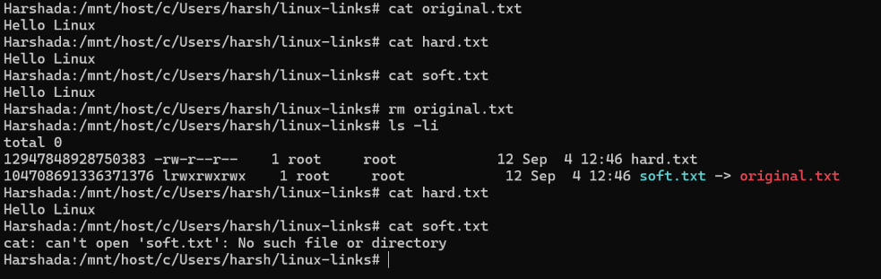


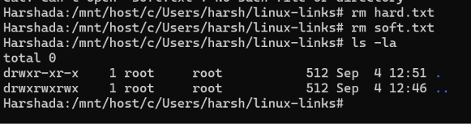

They document:
1. Creation of `original.txt`, `hard.txt`, and `soft.txt`.
2. Checking inode numbers using `ls -li`.
3. Removing hard and soft links.
4. Verifying that a hard link can still access the data after `original.txt` is removed.
5. Observing the behavior of a symbolic link when its target is no longer available.

## Task 2: `adduser` vs `useradd`

### Objective

- Learn the difference between `adduser` and `useradd`.
- Understand which command is preferred on Ubuntu/Linux and why.
- Create a test user using the recommended command.

### Commands Practiced

```bash
adduser testuser
useradd testuser
```
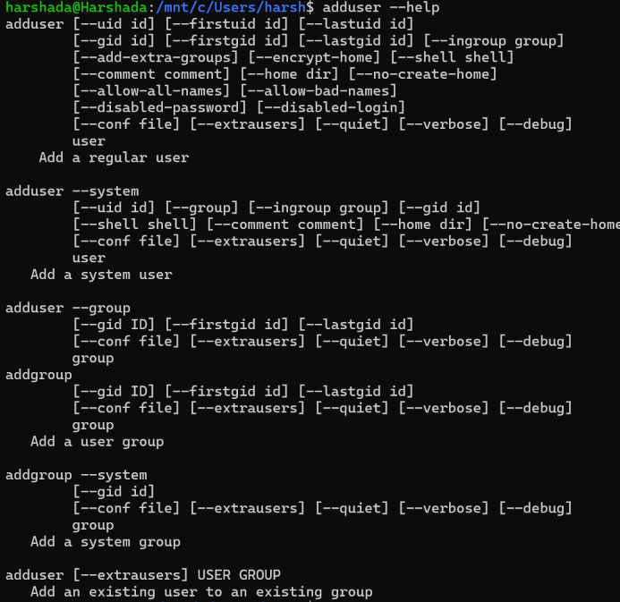


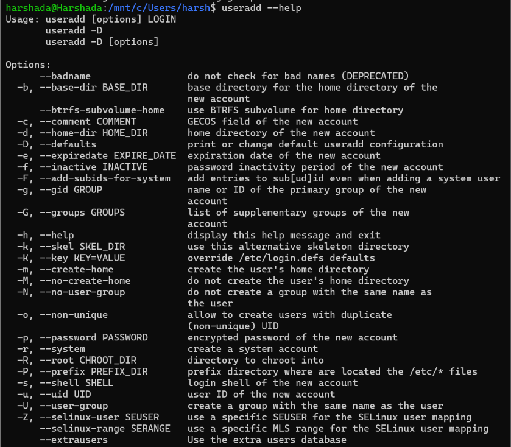


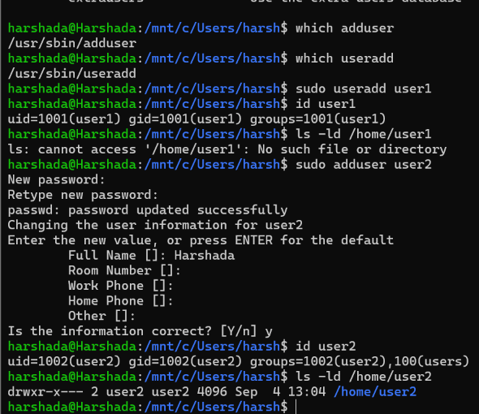

## Task 3: ## Task 3: journalctl

### Objective

The objective of this task is to learn how to use `journalctl` to view and manage system and service logs in Linux.

### 1. What is `journalctl` used for?

`journalctl` is a Linux command used to view and examine logs collected by the systemd journal.

It helps in monitoring system activity and troubleshooting problems by displaying system and service logs.

### 2. How to view system logs?

To view the system logs, use:

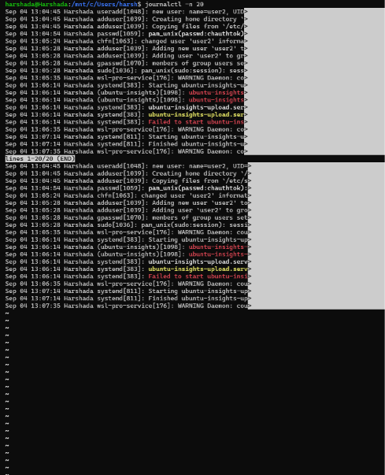


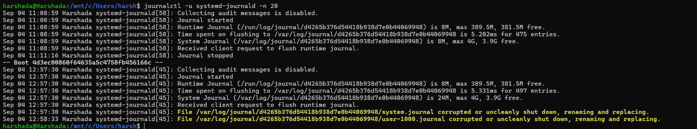


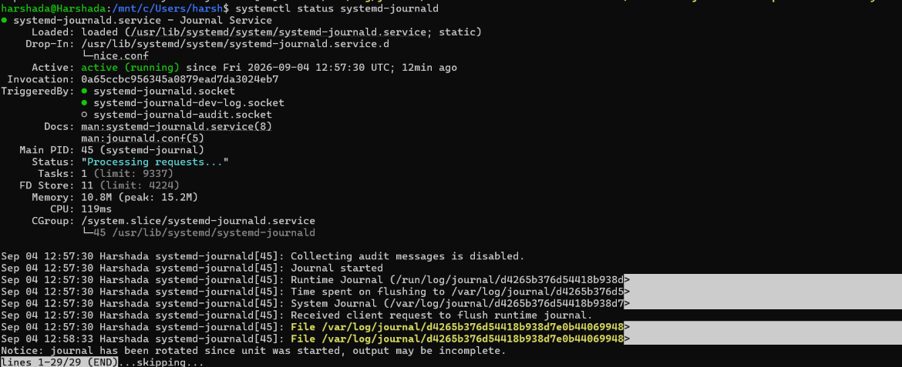

# Task 4: Linux Command Cheat Sheet

## Objective

The objective of this task is to review and practice important Linux networking commands, understand their purpose, and learn their basic usage.

---

## 1. `ip addr`

### Purpose

The `ip addr` command is used to display IP addresses and address information of network interfaces.

### Command

```bash
ip addr
```
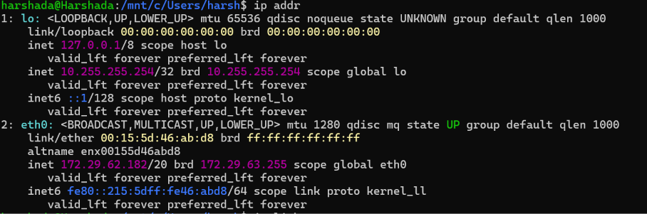
``` bash
ip link
```
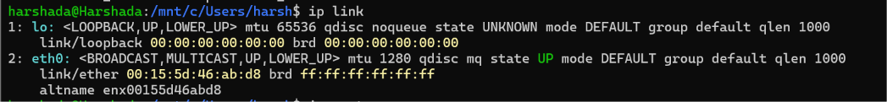
``` bash
ip route
```
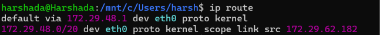
```bash 
ip neigh
``` 

``` bash
ip help
```
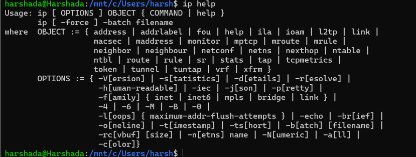
``` bash
ss -a
``` 
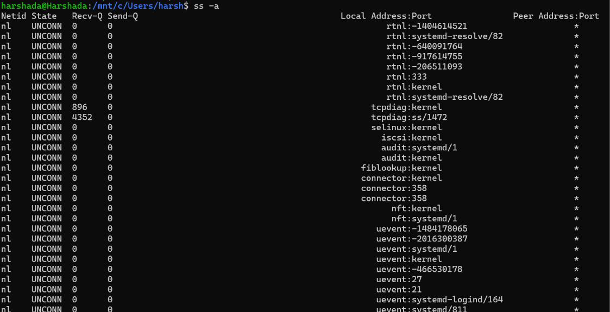
``` bash
ss -e
```
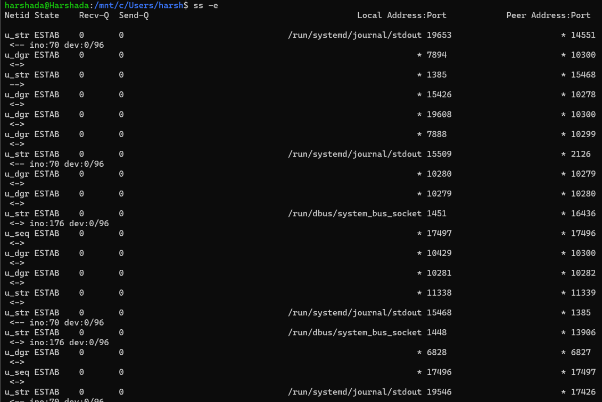
``` bash
ss -o
```
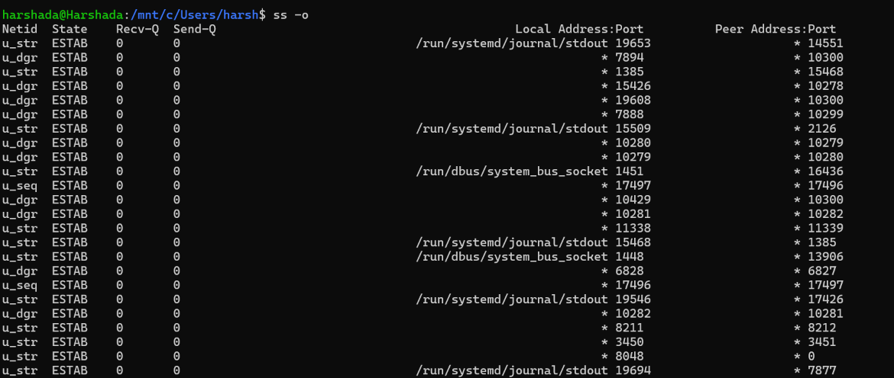
``` bash
ss -n
```
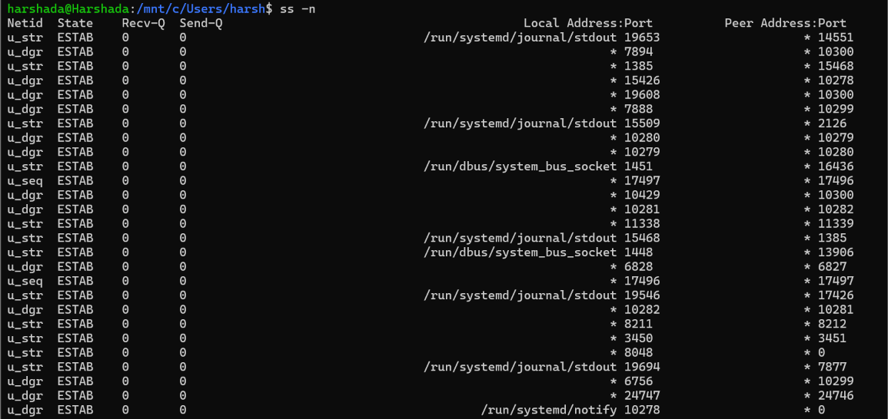
``` bash
ss -p
```
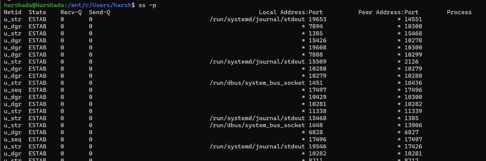
``` bash
arp -a 
ip neigh
```
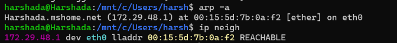
```bash
ifconfig -a 
ip addr
```
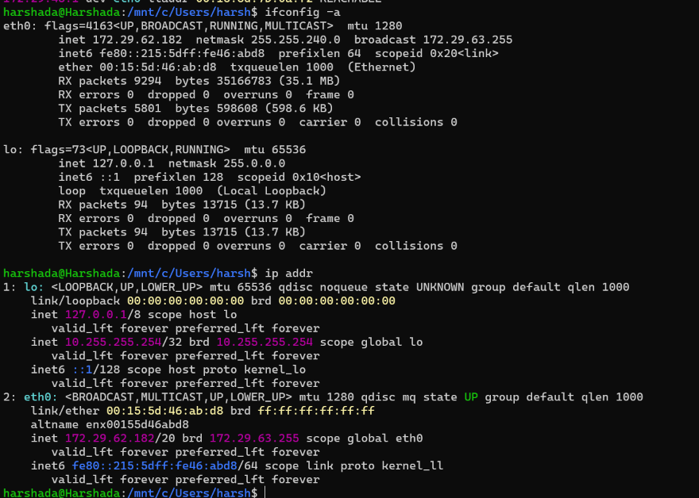