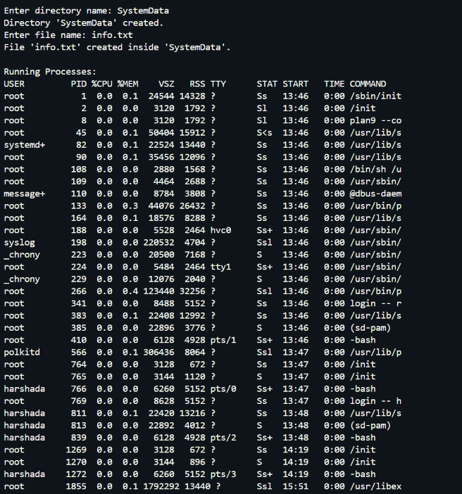
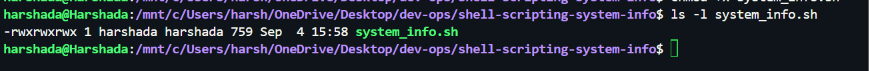
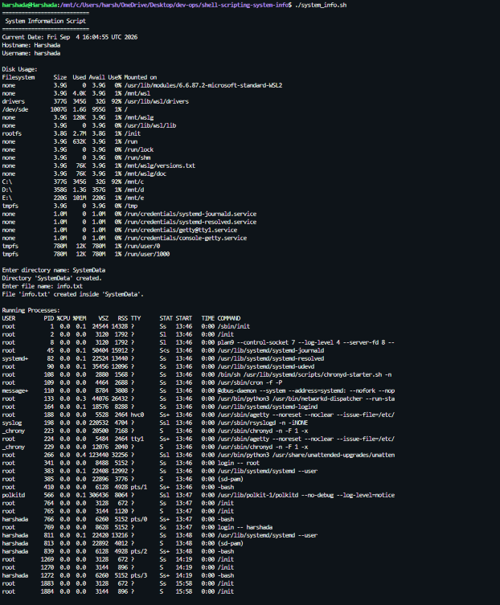
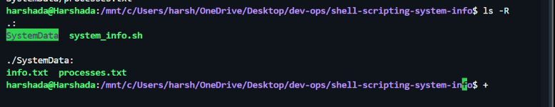
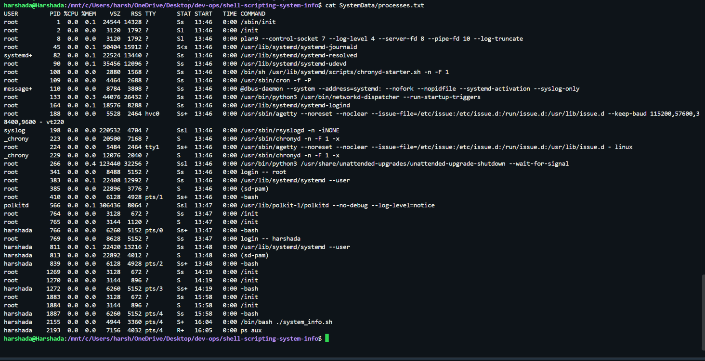

# Shell Scripting System Information Project

## Overview

This project demonstrates basic Linux shell scripting concepts including:

- Variables
- User input using `read -p`
- Displaying system information
- Creating directories and files
- Viewing disk usage
- Viewing running processes
- Output redirection

---

## Project Files

```text
shell-scripting-system-info/
│
├── README.md
├── system_info.sh
│
└── SystemData/
    ├── info.txt
    └── processes.txt
```

---

## Script Features

The script performs the following tasks:

1. Displays:
   - Current Date
   - Hostname
   - Username

2. Displays disk usage information using:

```bash
df -h
```

3. Accepts user input using:

```bash
read -p
```

4. Creates a directory using:

```bash
mkdir
```

5. Creates a file using:

```bash
touch
```

6. Displays running processes using:

```bash
ps aux
```

7. Saves process information to a file using output redirection:

```bash
ps aux > processes.txt
```

---

## How to Run

### Make the Script Executable

```bash
chmod +x system_info.sh
```

### Execute the Script

```bash
./system_info.sh
```

### Example Input

```text
Directory Name: SystemData
File Name: info.txt
```

---

## Screenshots

## 1. Project Folder Setup


## 2. Script Creation



## 3. Execute Permission


## 4. Script Execution



## 5. Directory and File Creation



## 6. Process Information Output



## 7. Disk Usage Information




---

## Commands Used

### Create Script File

```bash
touch system_info.sh
```

### Create Directory

```bash
mkdir -p SystemData
```

### Create File

```bash
touch SystemData/info.txt
```

### Display Disk Usage

```bash
df -h
```

### Display Running Processes

```bash
ps aux
```

### Save Process Information

```bash
ps aux > SystemData/processes.txt
```

---

## Learning Outcomes

Through this project, the following Linux shell scripting concepts were practiced:

- Shell script creation
- Variables
- User input
- File and directory management
- Process monitoring
- Disk usage monitoring
- Output redirection
- File permissions
- Git and GitHub workflow

---

## Author

**Name:** Harshada

**Course:** DevOps Lab / Shell Scripting Assignment