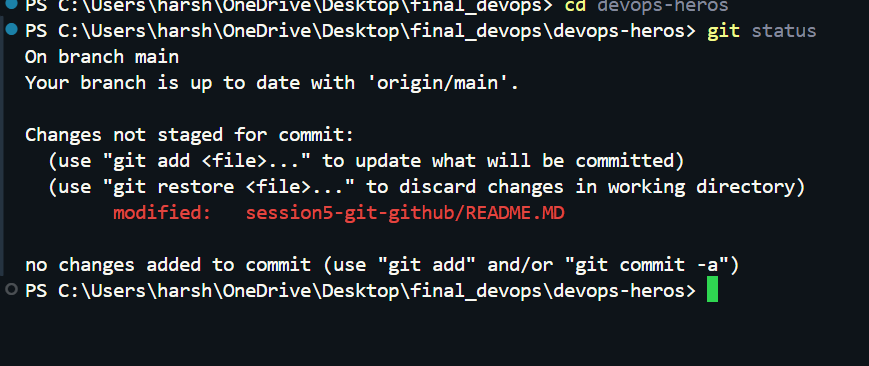
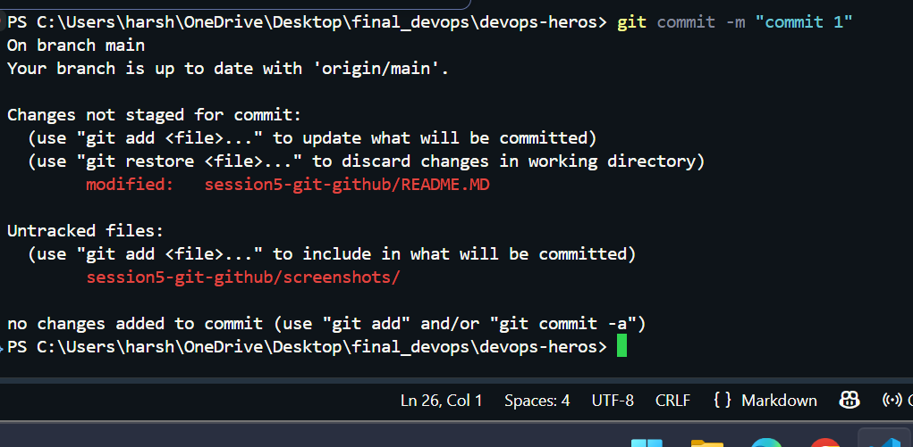
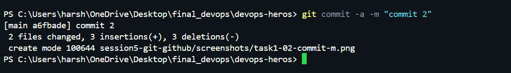
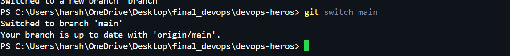
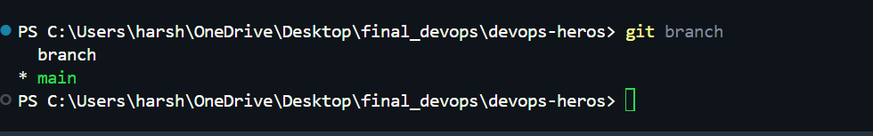
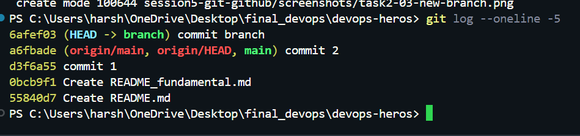

# Git Assignment: Commit and Cherry-Pick

**Name:** Harshada  
**Repository:** `git_github`  
**Tools:** Git, GitHub, Windows PowerShell

---

## Task 1: `git commit -a -m`

### Objective
Understand the difference between `git commit -a -m "message"` and `git commit -m "message"`.

### 1.1 Check the current repository status

Run these commands in PowerShell from inside your Git repository:

```powershell
git status
git branch --show-current
```

** Repository status**




### 1.2 Test `git commit -m`

This command commits changes that have already been staged. It does **not** automatically stage modified or newly created files.

Create or edit a tracked file, for example `README-task1.txt`, if needed. To demonstrate the difference, use a file that Git is already tracking.

```powershell
# Edit a tracked file, then run:
git status
git add <file-name>
git commit -m "Commit staged changes"
git log -1 --oneline
```

Replace `<file-name>` with the actual tracked file you edited.

**Screenshot 2 — `git commit -m`**

Take a screenshot showing `git add`, `git commit -m`, and the resulting commit output. You may include `git status` or `git log -1 --oneline` in the same screenshot.




### 1.3 Test `git commit -a -m`

Edit a **tracked** file again, then run:

```powershell
git status
git commit -a -m "Commit tracked changes with -a"
git log -1 --oneline
```

The `-a` option automatically stages modifications and deletions of tracked files. It does **not** include untracked files.

**Screenshot 3 — `git commit -a -m`**

Take a screenshot showing the modified tracked file, the command, and the successful commit output.

> Insert screenshot here.



### 1.4 Comparison

| Command | What it commits |
|---|---|
| `git commit -m "message"` | Changes already staged with `git add` |
| `git commit -a -m "message"` | Automatically stages and commits modifications/deletions of tracked files |
| Either command | Does not automatically include untracked files |

**Observation:** The `-a` option saves the separate `git add` step for changes to tracked files. New files must still be staged with `git add`.

---

## Task 2: Git Cherry-Pick

### Objective
Create 2–4 commits on `main`, create another branch with 2–3 commits, then cherry-pick one specific commit from that branch into `main`.

> **Important:** Make sure your working tree is clean before switching branches. Do not delete or overwrite existing work. If your repository already has the required commits, use them instead of repeating the steps below.

### 2.1 Switch to `main` and check status

```powershell
git status
git switch main
git status
git log --oneline -5
```

If `git status` shows uncommitted work, commit it or safely save it before switching branches.

**Screenshot 4 — Starting on `main`**

Take a screenshot showing `git switch main` and `git log --oneline -5`.

> Insert screenshot here.



### 2.2 Create 2–4 commits on `main`

Make a small, separate change for each commit. For example, add a section to your README, create a notes file, and then edit another tracked file. Stage and commit each change separately.

```powershell
git status
git add <file-name>
git commit -m "Add first main branch change"

# Make a second, separate change:
git add <file-name>
git commit -m "Add second main branch change"

# Optional: make one or two more separate commits.
git log --oneline -5
```

Replace each `<file-name>` with the file you actually changed. Make **2–4 commits in total** on `main`.

**Screenshot 5 — Commits on `main`**

Take a screenshot of `git log --oneline -5` showing your main-branch commits.


### 2.3 Create a new branch

Create and switch to a new branch. This example uses `cherry-pick-practice`; use another name if that branch already exists.

```powershell
git switch -c cherry-pick-practice
git branch
git status
```

**Screenshot 6 — New branch created**

Take a screenshot showing the new branch name and `git branch` output.




### 2.4 Make 2–3 commits on the new branch

Make 2–3 separate changes and commit each one separately.

```powershell
git add <file-name>
git commit -m "Add first feature branch change"

# Make another separate change:
git add <file-name>
git commit -m "Add second feature branch change"

# Optional third commit:
git log --oneline -5
```

**Screenshot 7 — Commits on the new branch**

Take a screenshot of `git log --oneline -5` showing the commits made on `cherry-pick-practice`.

> Insert screenshot here.



### 2.5 Identify the specific commit to cherry-pick

```powershell
git log --oneline
```

Choose **one commit** from the new branch that you want to copy to `main`. Copy its full or abbreviated commit hash from the first column.

Example only:

```text
a1b2c3d Add second feature branch change
e4f5g6h Add first feature branch change
```

Your actual hashes and commit messages will be different.

**Commit selected for cherry-pick:** `<paste-your-commit-hash-here>`

**Screenshot 8 — Identify the commit**

Take a screenshot of `git log --oneline` with the chosen commit visible. Make sure the commit hash and message can be read.

> Insert screenshot here.


### 2.6 Cherry-pick that commit into `main`

First ensure your working tree is clean, then switch to `main` and cherry-pick the selected hash:

```powershell
git status
git switch main
git cherry-pick <commit-hash>
```

Replace `<commit-hash>` with the actual hash you selected in Step 2.5. Do not type the angle brackets.

If Git reports a conflict, resolve the conflicting files, stage the resolved files with `git add <file-name>`, and run `git cherry-pick --continue`. If you need to cancel the operation, run `git cherry-pick --abort`.

**Screenshot 9 — Cherry-pick result**

Take a screenshot showing `git switch main`, the `git cherry-pick` command, and its output.

> Insert screenshot here.


### 2.7 Verify the commit is now on `main`

```powershell
git branch --show-current
git log --oneline -5
git show --stat --oneline HEAD
git status
```

Confirm that:
- The current branch is `main`.
- The cherry-picked change appears in the history on `main`.
- The expected files/changes are included.

A cherry-pick creates a **new commit on `main`** with the selected change. Its commit hash is usually different from the original commit on the other branch.

**Screenshot 10 — Verification on `main`**

Take a screenshot showing the current branch and log, plus the `git show --stat --oneline HEAD` output.

> Insert screenshot here.


### 2.8 Push the work to GitHub (if required)

If your assignment requires the branches and commits to appear on GitHub, push them:

```powershell
git push -u origin main
git push -u origin cherry-pick-practice
```

Only run these commands if `origin` is the correct remote and you have permission to push. If your branch has a different name, use that name instead.

**Screenshot 11 — GitHub repository**

Open the repository on GitHub and show the relevant branch/commit history. Take a screenshot only after the push succeeds.

> Insert screenshot here.


---

## Final Checklist

- [ ] Demonstrated `git commit -m "message"`.
- [ ] Demonstrated `git commit -a -m "message"`.
- [ ] Explained the difference between the two commands.
- [ ] Created 2–4 commits on `main`.
- [ ] Created a new branch and made 2–3 commits on it.
- [ ] Used `git log --oneline` to identify a specific commit.
- [ ] Cherry-picked that commit into `main`.
- [ ] Verified the change on `main`.
- [ ] Added screenshots in the marked locations.
- [ ] Uploaded this README and any screenshot files to GitHub.

## Screenshots Folder

Save screenshots in a folder named `screenshots` in the repository, using the filenames shown below:

```text
screenshots/
├── task1-01-status.png
├── task1-02-commit-m.png
├── task1-03-commit-a-m.png
├── task2-01-main-start.png
├── task2-02-main-commits.png
├── task2-03-new-branch.png
├── task2-04-feature-commits.png
├── task2-05-selected-commit.png
├── task2-06-cherry-pick.png
├── task2-07-verify-main.png
└── task2-08-github.png
```

To add the README and screenshots to Git:

```powershell
git add README.md screenshots/
git commit -m "Document Git commit and cherry-pick assignment"
git push
```

If you are not ready to commit the documentation yet, you can add and commit it later.
